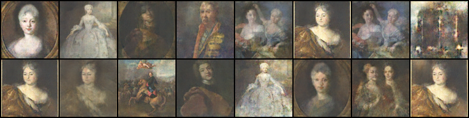
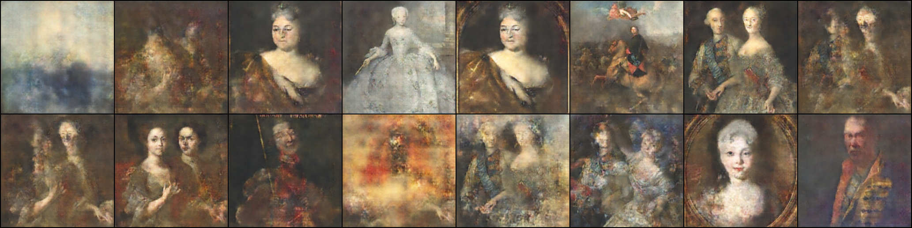
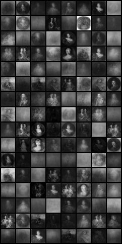
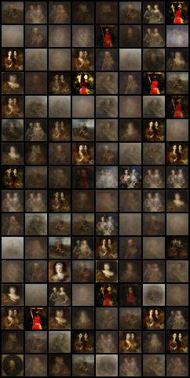
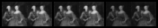
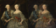

# Portrait Oil Painting Generation Using DCGAN And VAE

## Code reference

The code in the links below is reasonably referenced and heavily modified.

### DCGAN

The overall structure of the DCGAN model refers to the code in the following link, with many changes made to the number of deconvolution layers and parameter settings when used.

https://github.com/HuiiJi/GAN?tab=readme-ov-file 

### VAE

The theoretical derivation and basic structure of generating grayscale pictures for VAE are provided in the link. The basic structure of VAE generation model is built according to this tutorial, and a lot of code is modified on this infrastructure to achieve VAE image generation and color picture generation.

https://blog.csdn.net/weixin_43845922/article/details/129325896?ops_request_misc=%257B%2522request%255Fid%2522%253A%2522171033905316800185899475%2522%252C%2522scm%2522%253A%252220140713.130102334..%2522%257D&request_id=171033905316800185899475&biz_id=0&utm_medium=distribute.pc_search_result.none-task-blog-2~all~baidu_landing_v2~default-4-129325896-null-null.142^v99^control&utm_term=VAE生成图片&spm=1018.2226.3001.4187

##  LLM disclaimer

1. Using ChatGPT to help understand some online sample code.

2. Using ChatGPT to help find a solution when part of the code runs wrong.
   
3. When the VAE model is changed from grayscale to color, ChatGPT gives several modification methods for reference.

4. When viewing English tutorials and literature, use DeepL and ChatGPt to help with translation comprehension.

## Dataset

### painting/painting

This project uses a set of portrait oil painting data set on the Kaggle platform to train the deep learning model, which contains 2042 high-quality portrait oil painting pictures with relatively uniform style.

Dataset URL: https://www.kaggle.com/datasets/moosecat/art-images-drawings-painting-sculpture-engraving

## DCGAN

### DCGAN.ipynb

DCGAN is a model that combines deconvolutional neural network (CNN) and generative adversarial network (GAN). By means of adversarial training, the generative network learns how to generate realistic images, and while maintaining the ability of GAN to generate high-quality images, it effectively processes spatial hierarchical information in images by introducing convolutional layer. The resulting image is richer and more realistic in detail.

DCGAN model is used to train portrait oil painting data set to generate new portrait oil painting.

### DCGAN_modified.ipynb

In order to improve the clarity and detail capture ability of the generated image, the DCGAN model is improved, mainly by increasing the input size of the image. In order to accommodate the larger image size, the structure of the generator and discriminator has also been adjusted, mainly by increasing the number of convolutional layers.

### Weight parameter

In the folder are the weight parameters of the trained discriminator and generator models, which can be loaded when needed to use the already trained model to continue generating new data.

#### DCGAN_snapshots

Weight parameters of DCGAN model

#### DCGAN_modified_snapshots

Weight parameters of DCGAN model after optimization

## VAE

### VAE_grayscale.ipynb

The VAE model is constructed, the encoder learns the potential representation of the data, the decoder reconstructs the potential representation into the original data, and finally saves the sampled image corresponding to the potential vector z generated by the decoder and the reconstructed image of the original image.

The model is trained to obtain reconstructed images and sampled images.

### VAE_color.ipynb

In order to produce color images similar to DCGAN for subsequent comparison, a series of modifications were made to the previous code to enable it to produce color portraits with higher resolution. First, grayscale will be converted to color, the color channel from the original single channel to three channels (RGB), and the encoder and decoder are modified accordingly.

## New paintings

### new_paintings

· Oil painting generated by DCGAN model

· Oil painting generated using an optimized DCGAN model 

· Final generated result (DCGAN)

.png>)

· Oil painting generated by VAE model (grayscale)

· Oil painting generated by VAE model (Color)

· Oil painting reconstructed by VAE model (grayscale)

· Oil painting reconstructed by VAE model (Color)

